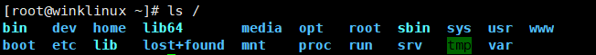
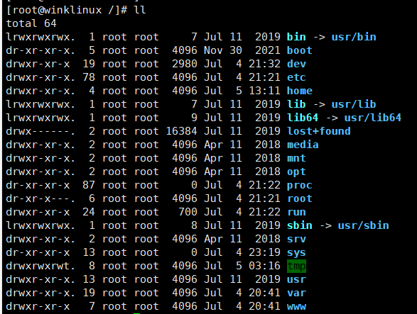
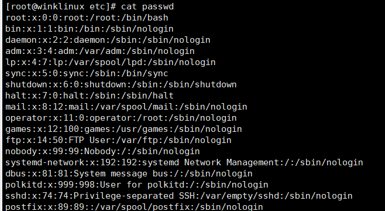
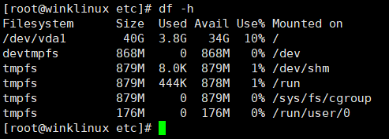
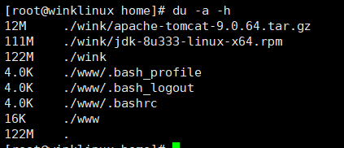

# Linux学习

> 一切皆文件
>
>  (文件:读,写,执行、权限: 用户,用户组、系统: 磁盘,进程)
>
> windows里的‘服务’(service)  在linux中叫 ‘守护进程’(daemon)

### 系统目录结构





- /bin： bin是Binary的缩写, 这个目录存放着最经常使用的命令。
- /boot： 这里存放的是启动Linux时使用的一些核心文件，包括一些连接文件以及镜像文件。
- /dev ： dev是Device(设备)的缩写, 存放的是Linux的外部设备，在Linux中访问设备的方式和访问文件的方式是相同的。
- **/etc： 这个目录用来存放所有的系统管理所需要的配置文件和子目录**
- **/home：用户的主目录，在Linux中，每个用户都有一个自己的目录，一般该目录名是以用户的账**
  **号命名的。类似windows中的用户目录** 
- /lib： 这个目录里存放着系统最基本的动态连接共享库，其作用类似于Windows里的DLL文件。
- /lost+found： 这个目录一般情况下是空的，当系统非法关机后，这里就存放了一些文件。
- /media：linux系统会自动识别一些设备，例如U盘、光驱等等，当识别后，linux会把识别的设备
  挂载到这个目录下。
- /mnt：系统提供该目录是为了让用户临时挂载别的文件系统的，我们可以将光驱挂载在/mnt/上，
  然后进入该目录就可以查看光驱里的内容了。
- ==**/opt：这是给主机额外安装软件所摆放的目录。比如你安装一个ORACLE数据库则就可以放到这个**
  **目录下。默认是空的。**==
- /proc： 这个目录是一个虚拟的目录，它是系统内存的映射，我们可以通过直接访问这个目录来获
  取系统信息。
- ==**/root：该目录为系统管理员，也称作超级权限者的用户主目录。**==
- /sbin：s就是Super User的意思，这里存放的是系统管理员使用的系统管理程序。
- /srv：该目录存放一些服务启动之后需要提取的数据。
- /sys：这是linux2.6内核的一个很大的变化。该目录下安装了2.6内核中新出现的一个文件系统
  sysfs 。
- ==**/tmp：这个目录是用来存放一些临时文件的。**==
- ==**/usr：这是一个非常重要的目录，用户的很多应用程序和文件都放在这个目录下，类似于windows**
  **下的program files目录。**==
  /usr/bin： 系统用户使用的应用程序。
  /usr/sbin： 超级用户使用的比较高级的管理程序和系统守护程序。
  /usr/src： 内核源代码默认的放置目录。
- /var：这个目录中存放着在不断扩充着的东西，我们习惯将那些经常被修改的目录放在这个目录
  下。包括各种日志文件。
- /run：是一个临时文件系统，存储系统启动以来的信息。当系统重启时，这个目录下的文件应该被
  删掉或清除。
- /www: 存放服务器网站相关的资源、环境、网站相关的项目

### 基本的命令学习

#### 常用快捷键

> ctrl+l	清屏
>
> ctrl+insert 复制
>
> shift+insert 粘贴

#### 目录管理

> 绝对路径、相对路径

```bash
cd	#切换目录命令 绝对路径都是以 /开头
./	#当前目录
cd ..	#返回上一级目录
cd ~	#回到用户目录
pwd 	#显示当前用户所在目录


ls		#列出目录
ll		
	-a	#参数:all 查看全部文件，包括隐藏文件
	-l	#参数	列出所有文件属性和权限，但是不包括隐藏文件，可以组合使用 ls -al

mkdir	#创建文件夹
	-p  #递归创建目录 	mkdir -p test1/test2
rmdir	#删除文件夹 只能是空文件夹
	-p  #递归删除
rm		#删除文件
	-f	#忽略不存在的文件,不会出现警告,强制删除！
	-r  #递归删除
	-i	#互动,询问是否删除
rm -rf /#删库跑路

cp		#复制文件夹或者目录	cp 文件 拷贝到的目录
mv		#移动文件    mv 文件 目的目录   |还可以重命名 mv 文件 改名字文件
touch	#创建文件
```

#### 基本属性

> 看懂文件属性 权限



实例中，boot文件的第一个属性用"d"表示。"d"在Linux中代表该文件是一个目录文件。
在Linux中第一个字符代表这个文件是目录、文件或链接文件等等：

- 当为[ d ]则是目录
- 当为[ - ]则是文件；
- 若是[ l ]则表示为链接文档 ( link file )；
- 若是[ b ]则表示为装置文件里面的可供储存的接口设备 ( 可随机存取装置 )；
- 若是[ c ]则表示为装置文件里面的串行端口设备，例如键盘、鼠标 ( 一次性读取装置 )。

接下来的字符中，以三个为一组，且均为『rwx』 的三个参数的组合。

其中，[ r ]代表可读(read)、[ w ]代表可写(write)、[ x ]代表可执行(execute)。

要注意的是，这三个权限的位置不会改变，如果没有权限，就会出现减号[ - ]而已。


drwxr-xr-x  	19	 root	 root  2980	 Jul  4 21:32 dev

owner/group/others        属主        属组     

```bash
chgrp   #属组名 文件名
chown	#属主名 文件名
chmod	#更改文件的九个属性
r:4  w:2 x:1 chmod 777
```

#### 文件内容查看

```bash
cat		#查看文件
nl		#带行号
more    #一页一页展示 空格翻页
less	#pageup pagedown上下翻页  退出
文件中 ？关键字 /关键字 #查找此关键字 N n下一个
```


#### 关机指令 

```bash
sync # 将数据由内存同步到硬盘
shutdown –h 10 # 这个命令告诉大家，计算机将在10分钟后关机
shutdown –h now # 立马关机
shutdown –r now # 系统立马重启
shutdown –r +10 # 系统十分钟后重启
reboot # 就是重启，等同于 shutdown –r now
halt # 关闭系统，等同于shutdown –h now 和 poweroff
```

不管是重启系统还是关闭系统，首先要运行 sync 命令，把内存中的数据写到磁盘中。

#### 链接

**硬链接**：一个文件多种路径，删除一个另一个也可以访问

**软连接**：类似windows快捷方式，删除源文件，快捷方式也访问不了

```bash
ln		#硬链接
ln -s 	#软链接
```

`echo`输入字符串

### Vim学习

> [welcome home : vim online](https://www.vim.org/)
>
> 程序开发工具

#### 命令模式

用户刚刚启动 vi/vim，便进入了命令模式

- i 切换到输入模式，以输入字符。
- x 删除当前光标所在处的字符。
- : 切换到底线命令模式，以在最底一行输入命令。（需要先按esc推出编辑模式）

#### 输入模式

在命令模式下按下i就进入了输入模式。
在输入模式中，可以使用以下按键：
字符按键以及Shift组合，输入字符

- ENTER，回车键，换行
- BACK SPACE，退格键，删除光标前一个字符
- DEL，删除键，删除光标后一个字符
- 方向键，在文本中移动光标
- HOME/END，移动光标到行首/行尾
- Page Up/Page Down，上/下翻页
- Insert，切换光标为输入/替换模式，光标将变成竖线/下划线
- ESC，退出输入模式，切换到命令模式

#### 底线命令模式

在命令模式下按下:（英文冒号）就进入了底线命令模式。
底线命令模式可以输入单个或多个字符的命令，可用的命令非常多。
在底线命令模式中，基本的命令有（已经省略了冒号）：

- q 退出程序
- w 保存文件

按ESC键可随时退出底线命令模式。

#### vim使用

| 按键       | 作用         |
| ---------- | ------------ |
| 数字＋回车 | 跳转到数字行 |
| :set nu    | 显示行号     |
| /文字      | 搜索文字     |
| ？文字     | 搜索文字     |
| u          | 撤销         |

### 账号管理

Linux系统是一个多用户多任务的分时操作系统，任何一个要使用系统资源的用户，都必须首先向系统管
理员申请一个账号，然后以这个账号的身份进入系统。

每个用户账号都拥有一个唯一的用户名和各自的口令。
用户在登录时键入正确的用户名和口令后，就能够进入系统和自己的主目录。
实现用户账号的管理，要完成的工作主要有如下几个方面：

- 用户账号的添加、删除与修改。
- 用户口令的管理。
- 用户组的管理。

#### 用户账号管理

```bash
useradd -选项 用户名 #添加用户
-m:自动在home中创建用户目录
-g:用户组
userdel -r 用户 #删除用户的时候也删除用户目录

usermod #修改用户
-d:改用户目录

su 用户 #切换用户
passwd 用户 #给用户加密码
-l:锁定用户 -u

```

添加用户就是往某一个文件中写入用户信息！ /etc/passwd

#### 用户组管理

属主 属组（开发、测试、运维、root）

本质是对 /etc/group文件修改

```bash
groupadd 用户组 #添加用户组
创建玩用户组后可以得到一个组id groupadd -g 1313 用户组
默认自增
groupdel #删除组
groupmod #修改组
-n:改名字
用户修改组
登录用户 -> $ newgrp root
```

#### 用户文件



```bash
用户名:口令:用户标识号:组标识号:注释性描述:主目录:登录Shell
```

登录口令在 /etc/shadow 被加密过 

### 磁盘管理

df(列出文件系统整体使用量)



 du（检查磁盘空间使用量）



检查根目录 

du -sm /*

### 进程管理

1.在linux中每一个程序都有自己的进程,每一个进程都有一个id号！

2.每一个进程,都有一个父进程！

3.进程可以有两种存在方式：前台！后台！

4.一般服务都是后台运行的,基本的程序都是前台运行的


ps 查看当前系统中正在执行的各种进程信息！

ps –选项
选项说明：

- -a：显示当前终端的所有进程信息(当前进程)
- -u：以用户的形式显示进程信息
- -x：显示后台进程运行的参数

```bash
ps -aux|
ps -aux|grep java #过滤进程信息


#| 在linux中叫管道符 A|B
#grep 查找文件中符合条件的字符串
```

**ps -ef** 	可以看到父进程信息

​		看父进程我们一般通过目录树结构查看

```bash
ps -ef|grep mysql
pstree -pu
	-p 进程id
	-u 显示用户组
```

杀死进程

**kill  -9**   进程id

强制结束该进程

### 防火墙

```bash
# 查看firewall服务状态
systemctl status firewalld

# 开启、重启、关闭、firewalld.service服务
# 开启
service firewalld start
# 重启
service firewalld restart
# 关闭
service firewalld stop
# 永久关闭防火墙
systemctl disable firewalld.service

# 查看防火墙规则
firewall-cmd --list-all    # 查看全部信息
firewall-cmd --list-ports  # 只看端口信息

# 开启端口
开端口命令：firewall-cmd --zone=public --add-port=80/tcp --permanent
重启防火墙：systemctl restart firewalld.service

命令含义：
--zone #作用域
--add-port=80/tcp  #添加端口，格式为：端口/通讯协议
--permanent   #永久生效，没有此参数重启后失效
```


### 软件的安装和部署

安装软件一般有三种方式：rpm、解压缩、yum在线安装

#### rpm 安装jdk

1、下载jdk，去oracle官网下载

2、安装java环境

```bash
# 检测当前系统是否以及安装java。 java -version
# rpm -qa|grep jdk  检测JDK版本信息
# rpm -e --nodeps jdk***

安装
# rpm -ivh package_name
```

3、配置环境变量

使用rpm安装不需要配置环境变量

```bash
vim /etc/profile
JAVA_HOME=/usr/java/jdk1.8.0_333-amd64
CLASSPATH=.:$JAVA_HOME/lib:$JAVA_HOME/jre/lib
export JAVA_HOME  CLASSPATH
```

让配置文件生效

```java
source /etc/profile
```


#### tar 安装tomcat

ssm war 需要放在tomcat下运行

1、下载tomcat    .tar.gz

2、解压tomcat 

```bash
tar -zxvf apache-tomcat-9.0.64.tar.gz
```

3、启动tomcat测试  ./xxx.sh 脚本即可运行

```bash
# 执行 ./startup.sh
# 停止 ./showdown.sh
```

域名解析后如果是80 -http 或者 443 -https可以直接访问，如果是8080 或者其他的端口就需要Apache或者Nginx做一下反向代理即可,配置文件即可；

#### yum 安装docker

1、官网 https://docs.docker.com/engine/install/centos/

2、检测CentOS7

```bash
cat /etc/redhat-release
```

3、安装环境

```bash
yum -y install 包名  # -y 所有的提示都确定为y
测试： yum -y install gcc gcc-c++
```

4、清楚版本

卸载

```bsah
 sudo yum remove docker \
                  docker-client \
                  docker-client-latest \
                  docker-common \
                  docker-latest \
                  docker-latest-logrotate \
                  docker-logrotate \
                  docker-engine
```

安装环境

```bash
 sudo yum install -y yum-utils
```

设置stable镜像仓库

```bash
# 推荐使用国内的
yum-config-manager --add-repo http://mirrors.aliyun.com/dockerce/linux/centos/docker-ce.repo
```

 更新yum软件包索引

```bash
 yum makecache fast
```

安装Docker CE

```bash
yum -y install docker-ce docker-ce-cli containerd.io
```

启动docker

```bash
 systemctl start docker
```

测试

```bash
docker version
docker run hello-world
docker images

```

配置镜像加速

```bash
sudo mkdir -p /etc/docker
sudo tee /etc/docker/daemon.json <<-'EOF'
{
"registry-mirrors": ["https://qiyb9988.mirror.aliyuncs.com"]
}
EOF
sudo systemctl daemon-reload
sudo systemctl restart docker

```

卸载

```bsah
systemctl stop docker
yum -y remove docker-ce
rm -rf /var/lib/docker

```

宝塔面板安装mysql

> 官网 bt.cn


