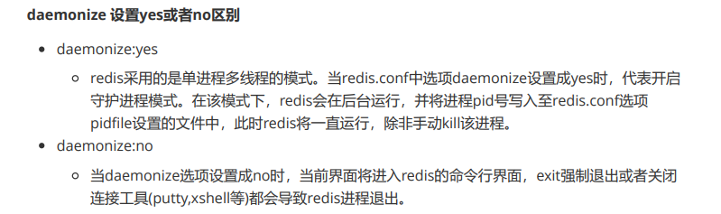

# Redis详解

> Redis是一个开源的key-value存储系统。
>
> 存储的value类型：string(字符串)、list(链表)、set(集合)、zset(sorted set --有序集合)和hash（哈希类型）
>
> 中文官网 http://redis.cn/

## Linux下安装

1、下载安装包  

建议移动到/opt目录下  

解压

2、安装基本环境

```bash
yum install gcc-c++

gcc版本低解决方法
yum -y install centos-release-scl
yum -y install devtoolset-9-gcc devtoolset-9-gcc-c++ devtoolset-9-binutils
#临时修改gcc版本
scl enable devtoolset-9 bash
#永久修改gcc版本
echo "source /opt/rh/devtoolset-9/enable" >>/etc/profile

make
make install
```

3、默认路径 

/usr/loacl/bin 创建自己的配置文件夹

拷贝到自己文件夹下 

```bash
cp redis.conf /usr/local/bin/winkconfig
```

4.修改配置文件后台启动

```bash
vim redis.conf
```




5.启动redis

```bash
redis-server redis.conf   #后面是启动需要的配置文件目录
redis-cli -p 6379
```

测试连接 


6.查看redis进程是否开启

```bash
ps -ef|grep redis
```


7.关闭redis服务

```bash
shutdown
exit
```

## 性能测试

```bash
redis-banchmark -h localhost -p 6379 -c 100 -n 10000
#  100个用户 10000个请求
```

## 基础知识

redis默认有16个数据库 默认使用第0个

可以查看配置文件 


## 基本操作

> http://redis.cn/commands.html

|       命令       |        内容         |
| :--------------: | :-----------------: |
|    select   x    |  选择第x+1号数据库  |
|      key *       |    查看所有的key    |
|  set key value   |     存储键值对      |
|     get key      |     获取键值对      |
|     flushdb      |   清空当前数据库    |
|     flushall     | 清空全部数据库内容  |
|    exists key    |   查看key是否存在   |
|   move key  db   | 移动key到指定数据库 |
|     del key      |       移除key       |
|     type key     |  查看当前key的类型  |
| append key value |  追加一个值到key上  |


```bash
expire keyname 10	# 10s后key过期
ttl keyname			# 查看过期时间
```


> redis是很快的,redis是基于内存操作 ，redis瓶颈是根据机器的内存和网络带宽

## 五大数据类型

### String

```bash
set key value  # 设置key
get key			# 获取值

=========================================================

mset k1 v1 k2 v2 # 批量设置
mget k1 k2		

=========================================================

append key value	# 追加value
strlen	key			# 获取key长度

=========================================================
incr key   # key++
decr key   # key--
incrby key 10 # 增10
setrange offset value	# 从偏移位置覆盖
=========================================================

setex key sencends value	# 设置key 过期时间
setnx key value		# 不存在再设置

=========================================================
getset key value # 先get再set 组合命令

```

### List

可作为堆、栈、阻塞队列

```bash

lpush key value		# 将一个或多个值插入到列表的头部
lrange key 0 -1     # 获取所有值
rpush key  value	# 放到栈底

lpop key			# 移除栈顶
rpop key			# 移除栈底
lindex key 1		# 通过下标获取值

llen				# list长度

lrem key x value	# 移除x个value
lest key x value	# 将列表中指定下标的值替换为另一个值
==================================================
# 为什么使用组合命令：`原子性` 
rpoplpush list1 list2 # 移除栈底放入另一个栈中
```

### Set

值不能重复

```bash
sadd key value			# 存
smembers key			# 查看
sismember key value		# 判断值是否存在
scard key				# 获取set值的数量
srem key 				# 移除
srandmember	key			# 随机获取一个 后面加数字可以指定个数
spop					# 随机移除
smove set1 set2 key		# 从一个集合移动到另一个集合
==================================================
sdiff key1 key2 # 差集
sinter key1 key2 # 交集 共同好友
sunion key1 key2 # 并集
```

### Hash

map集合,key-map集合

key-<key,value>

```bash
hset key field value
hget key field
hmset key f1 v1 f2 v2
hmget key f1 f2
hgetall


hlen					# 查看哈希表的指定字段长度
hexists key field			# 查看哈希表的指定字段是否存在

HKEYS 				#获取哈希表中的所有域（field）
HVALS				#获取哈希表中的所有域（field）的值

```

### Zset

有序集合

在set的基础上增加了一个值

```bash
zadd key x value 		# x用来排序
zrange key 0 -1 		# 打印所有 

zrangebyscore myset -inf +inf # 排序
		withscores   		  # 打印
zrevrange myset 0 -1 # 从大到小

```

## 三种特殊数据类型

### geospatial

地理位置

附近的人、朋友定位、打车距离

重新连接 redis-cli，增加参数 --raw ，可以强制输出中文

```bash
redis-cli -raw -p 6379
```


> - [GEOADD](http://redis.cn/commands/geoadd.html)
> - [GEODIST](http://redis.cn/commands/geodist.html)
> - [GEOHASH](http://redis.cn/commands/geohash.html)
> - [GEOPOS](http://redis.cn/commands/geopos.html)
> - [GEORADIUS](http://redis.cn/commands/georadius.html)
> - [GEORADIUSBYMEMBER](http://redis.cn/commands/georadiusbymember.html)


```bash
geoadd china:city 40.22 116.23  北京	# key 经度、纬度、名称
geopos china:city 北京 				# 获取指定城市经纬度

geodist china:city beijing shanghai km # 获取两地之间的距离
georaduis china:city 110 30 1000 km 	#范围内查找
		withdist   withcoord  count x 

georandiusbymember    china:city beijing 1000 km # 以城市为中心

```

### hyperloglog

> 是用来做基数统计的算法
>
> 统计网页的UV（浏览用户数量，一天内同一个用户多次访问只能算一次），传统的解决方案是使用Set来保存用户id，然后统计Set中的元素数量来获取页面UV。但这种方案只能承载少量用户，一旦用户数量大起来就需要消耗大量的空间来存储用户id。我的目的是统计用户数量而不是保存用户，这简直是个吃力不讨好的方案！而使用Redis的HyperLogLog最多需要12k就可以统计大量的用户数，尽管它大概**有0.81%的错误率**，但对于统计UV这种不需要很精确的数据是可以忽略不计的。

数据集 {1, 3, 5, 7, 5, 7, 8}， 那么这个数据集的基数集为 {1, 3, 5 ,7, 8}, 基数(不重复元素)为5。

基数估计就是在误差可接受的范围内，快速计算基数。

```bash
PFADD mykey a b c d e f g h i j

PFCOUNT mykey
10

PFADD mykey2 i j z x c v b n m

PFMERGE mykey3 mykey mykey2  # 合并

PFCOUNT mykey3
15
```

### bitmaps

> 位存储

BitMap 就是通过一个 bit 位来表示某个元素对应的值或者状态, 其中的 key 就是对应元素本身，实际上底层也是通过对字符串的操作来实现。

```bash
setbit sign 5 0 # 把第五个位置设为0
getbit sign 3   # 看看3位置参数

bitcount sign   # 统计1
```

## Redis事务

> Redis 事务的本质是一组命令的集合。
>
> Redis不保证原子性：
> Redis中，单条命令是原子性执行的，但事务不保证原子性，且没有回滚。事务中任意命令执行失败，其余的命令仍会被执行。
>
> Redis事务没有隔离级别的概念：
> 批量操作在发送 EXEC 命令前被放入队列缓存，并不会被实际执行！

- 开启事务（）
- 命令入队（）
- 执行事务（）

```bash
# 执行事务
multi	# 开启事务
set …………	# 命令入队
get …………
exec	# 执行事务
```


放弃事务

```bash
multi

discard  # 取消执行事务
```

> 编译型异常	代码有问题 事务中所有命令都不会执行
>
> 运行时异常	单独的错误会抛出异常，其余会继续执行

### 监视

**乐观锁**

- 认为什么时候都不会出问题，所以不会加锁
- 获取version
- 更新的时候比较version

**悲观锁**

- 认为什么时候都会出问题，无论做什么都会加锁

```bash
# 监视 watch
watch money
multi
decrby money 10
incrby out 10
exec
# 如果在watch后别的进程修改了money 则事务不会执行

unwatch # 结束监视

```

## Jedis

### java操作Redis

```java
//测试连接
public class TestPing {
    public static void main(String[] args) {
        //1.new jedis对象
        Jedis jedis = new Jedis("127.0.0.1",6379);
        System.out.println(jedis.ping());
    }
}
```

### 事务


```java
Transaction multi=jedis.multi(); //开启事务
try {
    multi.set("user","wi");
    multi.exec();           //执行事务
} catch (Exception e) {
    multi.discard();        //异常时取消事务
    e.printStackTrace();
} finally {
    System.out.println(jedis.get("user"));
    jedis.close();          //关闭事务
}
```

### SpringBoot整合

1、导入依赖

```xml
<!-- redis -->
<dependency>
    <groupId>org.springframework.boot</groupId>
    <artifactId>spring-boot-starter-data-redis</artifactId>
</dependency>
```

2、配置连接

```properties
# SpringBoot 所有的配置类，都有一个自动配置类
# 自动配置类都会绑定一个properties 配置文件 RedisProperties

spring.redis.host=127.0.0.1
spring.redis.port=6379
```

3、测试

```java
	@Resource
    private RedisTemplate redisTemplate;
    @Test
    void contextLoads() {

//        RedisConnection connection=redisTemplate.getConnectionFactory().getConnection();
//        connection.flushAll();
        //opsForValue String
        //opsForList List
        redisTemplate.opsForValue().set("name","wink");
        System.out.println(redisTemplate.opsForValue().get("name"));
    }
```


企业的redis一般会有自己的封装类


## Redis.conf配置

通过配置文件启动redis

> network **网络配置**

```bash
bind 127.0.0.1 # 绑定的ip
protected-mode yes # 保护模式
port 6379 # 默认端口
```

> GENERAL **通用**

```bash
daemonize yes # 默认情况下，Redis不作为守护进程运行。需要开启的话，改为 yes
supervised no # 可通过upstart和systemd管理Redis守护进程
pidfile /var/run/redis_6379.pid # 以后台进程方式运行redis，则需要指定pid 文件
loglevel notice # 日志级别。可选项有：
				# debug（记录大量日志信息，适用于开发、测试阶段）；
				# verbose（较多日志信息）；
				# notice（适量日志信息，使用于生产环境）；
				# warning（仅有部分重要、关键信息才会被记录）。
logfile "" # 日志文件的位置，当指定为空字符串时，为标准输出
databases 16 # 设置数据库的数目。默认的数据库是DB 0
always-show-logo yes # 是否总是显示logo
```

> SNAPSHOPTING 快照

```bash
# 900秒（15分钟）内至少1个key值改变（则进行数据库保存--持久化）
save 900 1
# 300秒（5分钟）内至少10个key值改变（则进行数据库保存--持久化）
save 300 10
# 60秒（1分钟）内至少10000个key值改变（则进行数据库保存--持久化）
save 60 10000
stop-writes-on-bgsave-error yes # 持久化出现错误后，是否依然进行继续进行工作
rdbcompression yes # 使用压缩rdb文件 yes：压缩，但是需要一些cpu的消耗。no：不压
缩，需要更多的磁盘空间
rdbchecksum yes # 是否校验rdb文件，更有利于文件的容错性，但是在保存rdb文件的时
候，会有大概10%的性能损耗
dbfilename dump.rdb # dbfilenamerdb文件名称
dir ./ # dir 数据目录，数据库的写入会在这个目录。rdb、aof文件也会写在这个目录
```

> SECURITY安全

访问密码的查看，设置和取消

```bash
# 启动redis
# 连接客户端
# 获得和设置密码
config get requirepass
config set requirepass "123456"
#测试ping，发现需要验证
127.0.0.1:6379> ping
NOAUTH Authentication required.
# 验证
127.0.0.1:6379> auth 123456
OK
127.0.0.1:6379> ping
PONG
```

### 主从复制

从机中配置主机IP 端口号  如果主机有密码注意配置密码


## Redis的持久化

### RDB（Redis DataBase）

Redis会单独创建（fork）一个子进程来进行持久化，会先将数据写入到一个临时文件中，待持久化过程
都结束了，再用这个临时文件替换上次持久化好的文件。整个过程中，主进程是不进行任何IO操作的。
这就确保了极高的性能。如果需要进行大规模数据的恢复，且对于数据恢复的完整性不是非常敏感，那
RDB方式要比AOF方式更加的高效。RDB的缺点是最后一次持久化后的数据可能丢失。


**Rdb 保存的是 dump.rdb 文件**

> 配置位置及SNAPSHOTTING解析


```bash
 save 120 10 # 120秒内修改10次则触发RDB
```


> 如何恢复

1、将备份文件（dump.rdb）移动到redis安装目录并启动服务即可
2、CONFIG GET dir 获取目录

```bash
127.0.0.1:6379> config get dir
dir
/usr/local/bin
```


> 优缺点

**优点：**
1、适合大规模的数据恢复
2、对数据完整性和一致性要求不高

**缺点：**
1、在一定间隔时间做一次备份，所以如果redis意外down掉的话，就会丢失最后一次快照后的所有修改
2、Fork的时候，内存中的数据被克隆了一份，大致2倍的膨胀性需要考虑。


### AOF（Append Only File）

将所有命令都记录下来

恢复的时候将所有命令全部执行一遍

默认不开启


**aof保存的文件是 appendonly.aof**


如果aof文件有错误那么redis是启动不了的

redis提供`redis-check-aof` 修复

```bash
redis-check-aof --fix appendonly.aof
```

> 优缺点

优点：
1、每修改同步：appendfsync always 同步持久化，每次发生数据变更会被立即记录到磁盘，性能较差
但数据完整性比较好
2、每秒同步： appendfsync everysec 异步操作，每秒记录 ，如果一秒内宕机，有数据丢失
3、不同步： appendfsync no 从不同步
缺点：
1、相同数据集的数据而言，aof 文件要远大于 rdb文件，恢复速度慢于 rdb。
2、Aof 运行效率要慢于 rdb，每秒同步策略效率较好，不同步效率和rdb相同。

## Redis发布订阅

Redis发布订阅(pub/sub)是一种消息通信模式  

Redis客户端可以订阅任意数量的频道

- [PSUBSCRIBE](http://redis.cn/commands/psubscribe.html)
- [PUBLISH](http://redis.cn/commands/publish.html)
- [PUBSUB](http://redis.cn/commands/pubsub.html)
- [PUNSUBSCRIBE](http://redis.cn/commands/punsubscribe.html)
- [SUBSCRIBE](http://redis.cn/commands/subscribe.html)
- [UNSUBSCRIBE](http://redis.cn/commands/unsubscribe.html)


> 测试

```bash
subscribe channel		# 订阅频道 一直监听

publish channel	message	# 向频道中发送消息

```


## Redis主从复制

### **概念**

主从复制，是指将一台Redis服务器的数据，复制到其他的Redis服务器。前者称为主节点(master/leader)，后者称为从节点(slave/follower)；数据的复制是单向的，只能由主节点到从节点。Master以写为主，Slave 以读为主。

主从复制的作用主要包括：
1、数据冗余：主从复制实现了数据的热备份，是持久化之外的一种数据冗余方式。

2、故障恢复：当主节点出现问题时，可以由从节点提供服务，实现快速的故障恢复；实际上是一种服务的冗余。

3、负载均衡：在主从复制的基础上，配合读写分离，可以由主节点提供写服务，由从节点提供读服务（即写Redis数据时应用连接主节点，读Redis数据时应用连接从节点），分担服务器负载；尤其是在写少读多的场景下，通过多个从节点分担读负载，可以大大提高Redis服务器的并发量。

4、高可用基石：除了上述作用以外，主从复制还是哨兵和集群能够实施的基础，因此说主从复制是Redis高可用的基础。


### 环境配置

复制三个配置文件


```bash
port 6379		         # 端口
daemonize yes			# 后台开启
pidfile /var/run/redis_6379.pid # pid
logfile "6379.log"		# 日志
dbfilename dump79.rdb	# rdb

redis-server redis79.conf
redis-server redis80.conf
redis-server redis81.conf
```

### 一主二从

```bash
info replication		# 查看配置

role:master
```

配置从机

```bash
slaveof 127.0.0.1 6379 # 此处是命令配置 暂时的 永久配置需要修改配置文件

# 配置成功后
role:master
connected_slaves:2
slave0:ip=127.0.0.1,port=6380,state=online,offset=98,lag=1
slave1:ip=127.0.0.1,port=6381,state=online,offset=98,lag=1

```

> 说明

主机可以写，从机只能读。主机所有保存的数据从机都会自动保存。

主机宕机，从机数据还在。

一主二从的情况下，如果主机断了，从机可以使用命令 `SLAVEOF NO ONE` 将自己改为主机！这个时候其余的从机链接到这个节点。对一个从属服务器执行命令 SLAVEOF NO ONE 将使得这个从属服务器关闭复制功能，并从从属服务器转变回主服务器，原来同步所得的数据集不会被丢弃。


> 复制原理

Slave 启动成功连接到 master 后会发送一个`sync`命令
Master 接到命令，启动后台的存盘进程，同时收集所有接收到的用于修改数据集命令，在后台进程执行完毕之后，master将传送整个数据文件到slave，并完成一次完全同步。
**全量复制**：而slave服务在接收到数据库文件数据后，将其存盘并加载到内存中。
**增量复制**：Master 继续将新的所有收集到的修改命令依次传给slave，完成同步
但是只要是重新连接master，一次完全同步（全量复制）将被自动执行

### 哨兵模式

自动选举主机

> 哨兵模式是一种特殊的模式，首先Redis提供了哨兵的命令，哨兵是一个独立的**进程**，作为进程，它会独立运行。其原理是哨兵通过发送命令，等待Redis服务器响应，从而监控运行的多个Redis实例


1、配置哨兵文件sentinel.conf

```bash
sentinel monitor myredis 127.0.0.1 6379 1
#				 主机名      ip     端口  投票
```

2、启动哨兵

```bash
Redis-sentinel /myredis/sentinel.conf
```

> 优缺点

**优点**

1. 哨兵集群模式是基于主从模式的，所有主从的优点，哨兵模式同样具有。
2. 主从可以切换，故障可以转移，系统可用性更好。
3. 哨兵模式是主从模式的升级，系统更健壮，可用性更高。

**缺点**

1. Redis较难支持在线扩容，在集群容量达到上限时在线扩容会变得很复杂。

2. 实现哨兵模式的配置也不简单，甚至可以说有些繁琐

   

哨兵模式所有配置

```bash
# Example sentinel.conf
# 哨兵sentinel实例运行的端口 默认26379

port 26379
# 哨兵sentinel的工作目录

dir /tmp

# 哨兵sentinel监控的redis主节点的 ip port
# master-name 可以自己命名的主节点名字 只能由字母A-z、数字0-9 、这三个字符".-_"组成。
# quorum 配置多少个sentinel哨兵统一认为master主节点失联 那么这时客观上认为主节点失联了
# sentinel monitor <master-name> <ip> <redis-port> <quorum>
sentinel monitor mymaster 127.0.0.1 6379 2

# 当在Redis实例中开启了requirepass foobared 授权密码 这样所有连接Redis实例的客户端都要提供密码
# 设置哨兵sentinel 连接主从的密码 注意必须为主从设置一样的验证密码
# sentinel auth-pass <master-name> <password>
sentinel auth-pass mymaster MySUPER--secret-0123passw0rd

# 指定多少毫秒之后 主节点没有应答哨兵sentinel 此时 哨兵主观上认为主节点下线 默认30秒
# sentinel down-after-milliseconds <master-name> <milliseconds>
sentinel down-after-milliseconds mymaster 30000

# 这个配置项指定了在发生failover主备切换时最多可以有多少个slave同时对新的master进行同步，这个数字越小，完成failover所需的时间就越长，但是如果这个数字越大，就意味着越多的slave因为replication而不可用。可以通过将这个值设为 1 来保证每次只有一个slave 处于不能处理命令请求的状态。
# sentinel parallel-syncs <master-name> <numslaves>
sentinel parallel-syncs mymaster 1

# 故障转移的超时时间 failover-timeout 可以用在以下这些方面：
#1. 同一个sentinel对同一个master两次failover之间的间隔时间。
#2. 当一个slave从一个错误的master那里同步数据开始计算时间。直到slave被纠正为向正确的master那里同步数据时。
#3.当想要取消一个正在进行的failover所需要的时间。
#4.当进行failover时，配置所有slaves指向新的master所需的最大时间。不过，即使过了这个超时，slaves依然会被正确配置为指向master，但是就不按parallel-syncs所配置的规则来了
# 默认三分钟
# sentinel failover-timeout <master-name> <milliseconds>
sentinel failover-timeout mymaster 180000

# SCRIPTS EXECUTION
#配置当某一事件发生时所需要执行的脚本，可以通过脚本来通知管理员，例如当系统运行不正常时发邮件通知相关人员。
#对于脚本的运行结果有以下规则：
#若脚本执行后返回1，那么该脚本稍后将会被再次执行，重复次数目前默认为10
#若脚本执行后返回2，或者比2更高的一个返回值，脚本将不会重复执行。
#如果脚本在执行过程中由于收到系统中断信号被终止了，则同返回值为1时的行为相同。
#一个脚本的最大执行时间为60s，如果超过这个时间，脚本将会被一个SIGKILL信号终止，之后重新执行。
#通知型脚本:当sentinel有任何警告级别的事件发生时（比如说redis实例的主观失效和客观失效等等），将会去调用这个脚本，这时这个脚本应该通过邮件，SMS等方式去通知系统管理员关于系统不正常运行的信息。调用该脚本时，将传给脚本两个参数，一个是事件的类型，一个是事件的描述。如果sentinel.conf配置文件中配置了这个脚本路径，那么必须保证这个脚本存在于这个路径，并且是可执行的，否则sentinel无法正常启动成功。
#通知脚本
# sentinel notification-script <master-name> <script-path>
sentinel notification-script mymaster /var/redis/notify.sh

# 客户端重新配置主节点参数脚本
# 当一个master由于failover而发生改变时，这个脚本将会被调用，通知相关的客户端关于master地址已经发生改变的信息。
# 以下参数将会在调用脚本时传给脚本:
# <master-name> <role> <state> <from-ip> <from-port> <to-ip> <to-port>
# 目前<state>总是“failover”,
# <role>是“leader”或者“observer”中的一个。
# 参数 from-ip, from-port, to-ip, to-port是用来和旧的master和新的master(即旧的slave)通信的
# 这个脚本应该是通用的，能被多次调用，不是针对性的。
# sentinel client-reconfig-script <master-name> <script-path>

sentinel client-reconfig-script mymaster /var/redis/reconfig.sh
```


## Redis缓存穿透和雪崩

高可用问题！

### 缓存穿透（查不到）

> 缓存穿透的概念很简单，用户想要查询一个数据，发现redis内存数据库没有，也就是缓存没有命中，于是向持久层数据库查询。发现也没有，于是本次查询失败。当用户很多的时候，缓存都没有命中，于是都去请求了持久层数据库。这会给持久层数据库造成很大的压力，这时候就相当于出现了缓存穿透。

**==解决方法==**

**布隆过滤器**

布隆过滤器是一种数据结构，对所有可能查询的参数以hash形式存储，在控制层先进行校验，不符合则
丢弃，从而避免了对底层存储系统的查询压力；


**缓存空对象**
当存储层不命中后，即使返回的空对象也将其缓存起来，同时会设置一个过期时间，之后再访问这个数
据将会从缓存中获取，保护了后端数据源；


但是这种方法会存在两个问题：
1、如果空值能够被缓存起来，这就意味着缓存需要更多的空间存储更多的键，因为这当中可能会有很多
的空值的键；
2、即使对空值设置了过期时间，还是会存在缓存层和存储层的数据会有一段时间窗口的不一致，这对于
需要保持一致性的业务会有影响。

### 缓存击穿（宕机恢复后查太多，缓存过期）

> 指一个key非常热点，在不停的扛着大并发，大并发集中对这一个点进行访问，当这个key在失效的瞬间，持续的大并发就穿破缓存，直接请求数据库，就像在一个屏障上凿开了一个洞。当某个key在过期的瞬间，有大量的请求并发访问，这类数据一般是热点数据，由于缓存过期，会同时访问数据库来查询最新数据，并且回写缓存，会导使数据库瞬间压力过大。

**==解决方法==**

**设置热点数据永不过期**

从缓存层面来看，没有设置过期时间，所以不会出现热点 key 过期后产生的问题。

**加互斥锁**

分布式锁：使用分布式锁，保证对于每个key同时只有一个线程去查询后端服务，其他线程没有获得分布
式锁的权限，因此只需要等待即可。这种方式将高并发的压力转移到了分布式锁，因此对分布式锁的考
验很大。

### 缓存雪崩(缓存集体失效)

> 缓存雪崩，是指在某一个时间段，缓存集中过期失效。

产生雪崩的原因之一，比如在写本文的时候，马上就要到双十二零点，很快就会迎来一波抢购，这波商品时间比较集中的放入了缓存，假设缓存一个小时。那么到了凌晨一点钟的时候，这批商品的缓存就都过期了。而对这批商品的访问查询，都落到了数据库上，对于数据库而言，就会产生周期性的压力波峰。于是所有的请求都会达到存储层，存储层的调用量会暴增，造成存储层也会挂掉的情况。

比较致命的缓存雪崩，是缓存服务器某个节点宕机或断网。因为自然形成的缓存雪崩，一定是在某个时间段集中创建缓存，这个时候，数据库也是可以顶住压力的。无非就是对数据库产生周期性的压力而已。而缓存服务节点的宕机，对数据库服务器造成的压力是不可预知的，很有可能瞬间就把数据库压垮。


**==解决方法==**

**redis高可用**
这个思想的含义是，既然redis有可能挂掉，那我多增设几台redis，这样一台挂掉之后其他的还可以继续
工作，其实就是搭建的集群。

**限流降级**
这个解决方案的思想是，在缓存失效后，通过加锁或者队列来控制读数据库写缓存的线程数量。比如对
某个key只允许一个线程查询数据和写缓存，其他线程等待。

**数据预热**
数据加热的含义就是在正式部署之前，我先把可能的数据先预先访问一遍，这样部分可能大量访问的数
据就会加载到缓存中。在即将发生大并发访问前手动触发加载缓存不同的key，设置不同的过期时间，让
缓存失效的时间点尽量均匀。


