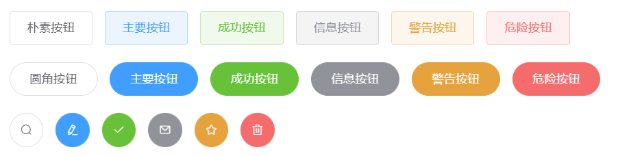
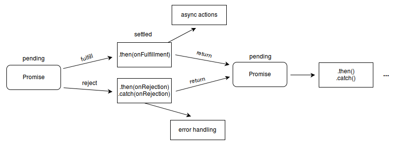
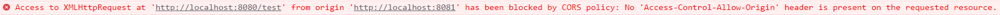

# Vue笔记

### 1.安装node.js

> Node.js 是一个基于 Chrome V8 引擎的 JavaScript 运行时。
>
> 中文官网: http://nodejs.cn/
>
> 下载对应系统安装包

```bash
#安装成功后
node -v #查看node版本
npm -v  #查看包管理工具npm版本
```

#### 配置环境变量

创建两个文件夹 `node_global` 、`node_cache`


打开cmd,设置路径

```bash
npm config set prefix "G:\Project\node\node_global"
npm config set cache "G:\Project\node\node_cache"
```

配置环境变量

1.修改用户变量中的Path

 

2.新建系统环境变量 NODE_PATH

| NODE_PATH                                |
| ---------------------------------------- |
| G:\Project\node\node_global\node_modules |

3.系统环境变量下的Path

| Path                        |
| --------------------------- |
| G:\Project\node\node_global |

#### 修改淘宝镜像

镜像

```bash
npm config set registry https://registry.npm.taobao.org/
npm config get registry
```

全局安装基于淘宝源的cnpm

> cnpm的服务器是由淘宝团队提供的服务器，在国内cnpm是npm镜像，一般会同步更新，相差在10分钟，所以cnpm在安装一些软件时候会比较有优势。但是一般cnpm只用于安装时候，所以在项目创建与卸载等相关操作时候我们还是使用npm。

```bash
npm install -g cnpm --registry=https://registry.npm.taobao.org
```

### 2.创建你的第一个vue

#### 安装vue脚手架

```bash
vue --version #查看版本
npm install -g @vue/cli
```

创建项目

```bash
vue create vuedemo #项目名称
#然后选择vue版本 
#此处选择vue2
#进入项目
npm run serve
#跑起来
```

#### 分析目录结构


- node_modules 所有依赖项
- public 静态内容
  - favicon.ico 小图标
  - index.html

- src 项目执行的主目录
  - assets 静态文件
  - components 组件
  - router 路由配置文件
  - views 放置页面内容
  - App.vue 项目的根组件，文件中可以写路由出口和路由链接 ，在 main.js里引入
  - main.js 项目的主入口文件

- .gitignore git的忽略文件
- babel.config.js 设置 babel 的配置的
- package.json 所有依赖包配置文件
- README.md 项目文档

### 3.vue基础语法

#### 基础命令

{{胡子语法}} 使用data中的值

| 标签           | 作用                                                         |
| :------------- | :----------------------------------------------------------- |
| v-once         | 当data数据中的值改变时，v-once中的值不会改变                 |
| v-text、v-html | 相当于innerText、innerHtml                                   |
| v-bind         | 将data数据绑定在属性当中,语法糖:直接使用  :属性  替代        |
| v-model        | **双向绑定** 如果改变输入值,data数据将被改变，多用于表单、输入框     v-bind是**单向绑定** |
| v-show         | true false 显示或者不显示                                    |
| v-for          | 类似foreach     v-for="stu in stulist" :key="stu.id"         |
| v-if           | 需要一个布尔值来显示或者不显示标签                           |
| v-on           | 绑定时间 例如 v-on:click 可以简写为 @click                   |

| 属性          | 作用                                                         |
| ------------- | ------------------------------------------------------------ |
| data() { }    | 数据    变量名:" "                                           |
| method:{}     | 方法    方法名(){}                                           |
| computed:{}   | 定义复杂变量    变量:function(){  return    this.--+this.--;  } |
| component:{}  | 全局组件 组件名:{ template: }                                |
| components:{} | 局部组件                                                     |
| props:[]      | 父组件给子组件传参，子组件用props数组接收                    |

#### 组件嵌套

父组件传给子组件传数据

```vue
<!--父组件-->
<template>
  <div>
    <!-- 给子组件test变量 赋予name的值 -->
    <B :test="name" />
  </div>
</template>

<script>
//调用子组件
import B from '@/components/B.vue';
export default {
  data() {
    return {
      name: 'wink',
    };
  },
  //声明子组件
  components:{
    B,
  }
}
</script>

<style>
</style>

<!-- 子组件 -->
<template>
    <div>
     接收到的参数{{ test }}
    </div>
</template>

<script>
export default {
    data() {
        return {

        };
    },
    //用数组存储
    props:["test"]
}
</script>

<style>
</style>
```

### 4.Element-ui

#### 快速上手

> 网站快速成型工具 官网：https://element.eleme.cn/#/zh-CN

vue项目中安装element-ui

```bash
npm i element-ui -S
```

因为是使用脚手架开发的所以需要在main.js中引用

```
import Vue from 'vue';
import ElementUI from 'element-ui';
import 'element-ui/lib/theme-chalk/index.css';
import App from './App.vue';

Vue.use(ElementUI);
```

#### 常用组件

**Layout 栅格系统**，将网页分为24份

```html
<!-- 栅格系统示例 -->
<el-row>
  <el-col :span="8"><div class="grid-content bg-purple">第一块</div></el-col>
  <el-col :span="8"><div class="grid-content bg-purple">第二块</div></el-col>
  <el-col :span="8"><div class="grid-content bg-purple">第三块</div></el-col>
</el-row>

<el-col :span="分区" :gutter="指定间隔" :offset="偏移">
    
<!--将 type 属性赋值为 'flex'，可以启用 flex 布局，并可通过 justify 属性来指定 start, center, end, space-between, space-around 其中的值来定义子元素的排版方式。-->
<el-row type="flex" class="row-bg" justify="center">
  <el-col :span="6"><div class="grid-content bg-purple"></div></el-col>
  <el-col :span="6"><div class="grid-content bg-purple-light"></div></el-col>
  <el-col :span="6"><div class="grid-content bg-purple"></div></el-col>
</el-row>
<!--参照bootstrap中的响应式布局-->    
<el-row :gutter="10">
  <el-col :xs="8" :sm="6" :md="4" :lg="3" :xl="1">
      <div class="grid-content bg-purple"></div>
  </el-col>
  <el-col :xs="4" :sm="6" :md="8" :lg="9" :xl="11">
      <div class="grid-content bg-purple-light"></div>
  </el-col>
  <el-col :xs="4" :sm="6" :md="8" :lg="9" :xl="11">
      <div class="grid-content bg-purple"></div>
  </el-col>
  <el-col :xs="8" :sm="6" :md="4" :lg="3" :xl="1">
      <div class="grid-content bg-purple-light"></div>
  </el-col>
</el-row>
```

**主要按钮**

```html
<el-row>
  <el-button plain>朴素按钮</el-button>
  <el-button type="primary" plain>主要按钮</el-button>
  <el-button type="success" plain>成功按钮</el-button>
  <el-button type="info" plain>信息按钮</el-button>
  <el-button type="warning" plain>警告按钮</el-button>
  <el-button type="danger" plain>危险按钮</el-button>
</el-row>

<el-row>
  <el-button round>圆角按钮</el-button>
  <el-button type="primary" round>主要按钮</el-button>
  <el-button type="success" round>成功按钮</el-button>
  <el-button type="info" round>信息按钮</el-button>
  <el-button type="warning" round>警告按钮</el-button>
  <el-button type="danger" round>危险按钮</el-button>
</el-row>
<!--带图标-->
<el-row>
  <el-button icon="el-icon-search" circle></el-button>
  <el-button type="primary" icon="el-icon-edit" circle></el-button>
  <el-button type="success" icon="el-icon-check" circle></el-button>
  <el-button type="info" icon="el-icon-message" circle></el-button>
  <el-button type="warning" icon="el-icon-star-off" circle></el-button>
  <el-button type="danger" icon="el-icon-delete" circle></el-button>
</el-row>
```



### 5.Bootstrap

#### 安装

> 也是一个组件库  这里使用 5.0 版本
>
> 中文官网: https://v5.bootcss.com/

在vue项目中直接使用命令安装

```bash
npm install bootstrap@5.2.0
```

在vue main.js中引入

```js
import "bootstrap/dist/css/bootstrap.min.css"
import "bootstrap/dist/js/bootstrap.min.js"
```

#### 基础使用

```html
<!--也有栅格系统不过分为12份-->
<div class="container">
  <div class="row">
    <div class="col">
      Column
    </div>
    <div class="col">
      Column
    </div>
    <div class="col">
      Column
    </div>
  </div>
</div>
```

### 6.了解基础js知识

####  创建对象

```js
var student={
    //变量
    sno:1,
    //数组
    friends:["wink","tym"],
	//方法
    showSno:function (){
        console.log(this.sno);
    }
};
```

#### 箭头函数

```js
	//对象内的函数
	test:function(data){
        console.log(data);
    },
    //简化
    test(data){
        console.log(data);
    },
    //箭头函数
    test:(data)=> {
        console.log(data);
    },
    //箭头函数,当参数只有一个可以省略括号
    //使用箭头函数this不在指向本身
    test:data=> {
        console.log(data);
    }
```

vue中使用箭头函数 this会调用data中的变量

#### jquery速速上手

> jQuery 是一个 JavaScript 库。
>
> jQuery 极大地简化了 JavaScript 编程。

vue中使用

```bash
npm install jQuery
```

jQuery 选择器基于元素的 id、类、类型、属性、属性值等"查找"（或选择）HTML 元素。

```js
$(document).ready(function(){
   // 开始写 jQuery 代码...
});
//简洁写法
$(function(){
   // 开始写 jQuery 代码...
});
//选择
$(".div1")
$("#p1").css("color","red").slideUp(2000).slideDown(2000);
```

Ajax

>  AJAX = 异步 JavaScript 和 XML（Asynchronous JavaScript and XML）。

```js
$.ajax({name:value, name:value, ... })
//示例
$("button").click(function(){
    $.ajax({url:"demo_test.txt",
            success:function(result){
        		$("#div1").html(result);
    }});
});
```


### 7.axios

#### JS Promise：axios

> Promise 是JS中一种处理异步操作的机制
>
> 一个 Promise 对象表示一个异步操作的执行结果，包括状态（成功/失败）和值（成功返回值/错误原因）。一个 Promise 在创建的时候异步操作可能还没执行完成，通过持有这个 Promise 对象，可以在未来异步操作完成的时候对结果进行相应操作。
>
> *Pending 待定：*刚创建时的初始状态，还没有确定执行结果
>
> *Fulfilled 已兑现：*异步操作执行成功，并返回一个值
>
> *Rejected 已拒绝：*异步操作执行失败，并返回一个错误原因
>
> *Settled 已敲定 / Resolved 已决议*：“待定”状态的反面，都表示异步操作已经执行完成，即已兑现**或**已拒绝
>
> 转自：https://www.cnblogs.com/skuld-yi/p/14599594.html



回调函数解释

```js
setTimeout(function(){
    console.log("成功!");
}, 250);
//此处steTimeout就是一个异步 第一个参数就是回调函数
```

#### .then()

> then() 方法的语法很简单，有两个可选参数，分别代表当 Promise 的状态变为成功（fulfilled）和失败（rejected）时所使用的回调函数。
>
> 如果只想绑定 `onRejected`（即失败时的错误处理函数），下面两种写法完全等价，第二种是第一种的简写形式。
>
> ```js
> p.then(null, failureCallback);
> p.catch(failureCallback);
> ```

链式调用

能做到链式调用的魔法来自 `then()` 方法：它会在执行相应的回调函数之后，返回一个新的 Promise 对象，并且插入 Promise 链的当前位置。

#### axios使用

```js
const axios=require('axios')

axios({
    url:"http://localhost:8080/test",//后端页面路径
    method:'GET',//请求方法
}).then(res => {
    console.log(res.data);//返回json数据
})
```

```js
//前端
const axios=require('axios')
axios({
    url:"http://localhost:8080/insert",//后端页面路径
    method:'POST',//请求方法
    data:{
        sno: 26,
        sname: 'tttyyyy',
        age: 20,
        subject: '女',
        schoolName: '武昌首义学院',
        className: '15'
    }
})
//后端
@PostMapping("/insert")
    public void insert(@RequestBody Student s){//json转换成实体类
        System.out.println(s);
        studentMapper.insert(s);
    }
```

#### 在vue中使用

```vue
import axios from 'axios'

methods: {
    send() {
      axios({
        url:'http://localhost:8080/test',
        method:'GET'
      }).then(res =>{
        console.log(res.data);
      })
    },
  }
```

### 8.vue-router急成

安装vuerouter

```
npm i vue-router@3
```

创建router文件夹及index.js

```js
import Vue from 'vue'
// 导入路由插件
import Router from 'vue-router'
// 导入上面定义的组件 例子Content
import Content from '../components/Content'
// 安装路由
Vue.use(Router);
// 配置路由
export default new Router({
    mode: 'history',
	routes: [
{
// 路由路径
path: '/content',
// 路由名称
name: 'content',
// 跳转到组件
component: Content
}
]
});
```


main.js配置

```js
//router
import VueRouter from 'vue-router'
import router from './router'

Vue.use(VueRouter)

new Vue({
  render: h => h(App),
  router,
  components: { App },
  template: '<App/>'

}).$mount('#app')
```


### 9.跨域

如果不跨域的话



前端后端两个端口不一样,所以会存在跨域问题（协议名字、ip地址名、端口号有一个不相同就会出现跨域问题）

```java
//controller层添加以下注解
@CrossOrigin(origins={"*","null"})
```

### 10.JWT

> JSON Web Token
>
> 授权认证，一旦用户登录，后续每次请求都会携带JWT

#### 组成

1. Header

```java
{
    'typ':"JWT",	//类型
    'alg':'HS256'		//加密方式
}
```

2. Payload (存放有效信息)

```java
{
    "sub":'121212',
    "name":'jhn',
    "admin":'true'
}
```

3. Signature(签名)

```js
var encodedSting = base64UrlEncode(header)+'.'+base64UrlEncode(payload)
//将Header和Payload编码
var signature =HMACSHA256(encodedString,'secret')
//再次加密
```

### 11.thymeleaf

> 10分钟入门
>
> http://c.biancheng.net/spring_boot/thymeleaf.html

引入

```html
<html lang="en" xmlns:th="http://www.thymeleaf.org">
```


```html

<div >
<h1 th:text="thymeleaf"> NIHAI1</h1> <!--替换数据-->
    <a th:href="@{/login1}">tiaozhuan</a><!--请求路径-->
</div>


<!--循环-->
<ul th:each="m:${session.type1}">
	<li>
      <div class="img">
		 
	  </div>
	  <h3 class="title" th:text="${m.getGoodsName()}" >商品名字</h3>
       <p class="desc" th:text="${m.getGoodsComment()}">商品描述</p>
	   <p class="price" th:text="${m.getGoodsPrice()}">商品价格</p>
	</li>
</ul>

<!--传参数-->
<a th:herf></a>
```

